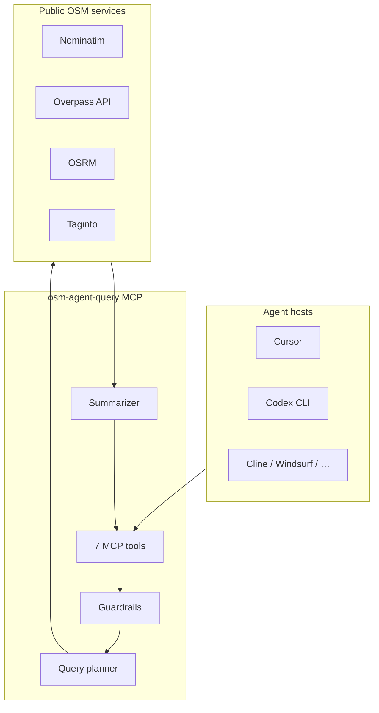

<p align="center">
  <strong>osm-agent-query</strong><br/>
  Structured OpenStreetMap access for AI coding agents
</p>

<p align="center">
  <a href="https://github.com/diabmoh/osm-agent-query/actions/workflows/ci.yml"></a>
  <a href="https://www.npmjs.com/package/osm-agent-query"></a>
  
  <a href="LICENSE"></a>
</p>

---

**osm-agent-query** is a [Model Context Protocol](https://modelcontextprotocol.io) server that lets Codex, Cursor, Cline, and other agents use [OpenStreetMap](https://www.openstreetmap.org) safely.

Agents get **seven small tools** with validated inputs, an internal Overpass query planner, rate-limit guardrails, and **token-efficient** responses (`summary` + `data`)—not a catalog of 30+ APIs and not raw OverpassQL.

## Why this exists

| Problem | How we solve it |
|--------|------------------|
| LLMs write broken **OverpassQL** | Queries are built from structured intents; agents never execute arbitrary QL |
| **Huge** OSM MCP tool lists confuse models | Seven focused tools with clear descriptions |
| Full OSM JSON **floods context** | Summarized places, trimmed tags, optional `distance_m` sorting |
| Public APIs get **hammered** | Nominatim rate limit (~1 req/s), bbox caps, result limits, identifiable User-Agent |

## Architecture



Deep dive: [docs/ARCHITECTURE.md](docs/ARCHITECTURE.md)

## Quick start

**Requirements:** Node.js 20+

### Run with npx (recommended)

```bash
npx osm-agent-query@latest
```

Add to **Cursor** (`.cursor/mcp.json` or Settings → MCP):

```json
{
  "mcpServers": {
    "osm-agent-query": {
      "command": "npx",
      "args": ["-y", "osm-agent-query"]
    }
  }
}
```

### From source

```bash
git clone https://github.com/diabmoh/osm-agent-query.git
cd osm-agent-query
npm install && npm run build
node dist/index.js --version
```

Local path config:

```json
{
  "mcpServers": {
    "osm-agent-query": {
      "command": "node",
      "args": ["/absolute/path/to/osm-agent-query/dist/index.js"]
    }
  }
}
```

Restart the editor after changing MCP settings.

## Tools

| Tool | What it does |
|------|----------------|
| `geocode` | Place name or address → coordinates + bbox |
| `reverse_geocode` | Coordinates → address / display name |
| `search_nearby` | Category + lat/lon + radius → nearby POIs (sorted by distance) |
| `search_in_area` | Category + place name or bbox → POIs in area |
| `route` | A→B distance & duration (foot / driving / cycling) |
| `explain_osm_tags` | Tag documentation + alternatives; or list categories |
| `preview_query` | Debug: show planned Overpass query **without** executing |

### Response shape

Every successful tool returns:

```json
{
  "ok": true,
  "summary": "Found 12 Pharmacy(s) within 800m.",
  "data": { }
}
```

Errors return `{ "error": true, "code": "NOT_FOUND", "message": "..." }` with MCP `isError`.

### Example: coffee near a landmark

1. **`geocode`** — `{ "query": "Eiffel Tower, Paris", "limit": 1 }`  
2. **`search_nearby`** — `{ "category": "cafe", "lat": 48.858, "lon": 2.294, "radius_m": 600 }`  
3. **`route`** — `{ "from_lat": 48.858, "from_lon": 2.294, "to_lat": 48.860, "to_lon": 2.337, "profile": "foot" }`

### Search categories

`restaurant`, `cafe`, `pharmacy`, `supermarket`, `hospital`, `school`, `parking`, `ev_charging`, `hotel`, `bank`, `fuel`, `park`, `library`, `museum`, `dentist`, `bakery`, `atm`, `post_office`, `bar`, `cinema`

Custom tags: `{ "category": "custom", "tag_key": "amenity", "tag_value": "bicycle_rental" }`

## Comparison

| | **osm-agent-query** | Typical OSM MCP servers |
|--|---------------------|-------------------------|
| Tool count | 7, composable | Often 20–30+ |
| OverpassQL | Internal only | Often exposed to the model |
| Responses | `summary` + trimmed `data` | Often raw OSM JSON |
| Agent skill | Shipped in `skills/` | Rare |
| Eval harness | 16 tasks, CI dry-run | Rare |

## Agent skill

Install [skills/osm-agent-query/SKILL.md](skills/osm-agent-query/SKILL.md) so your agent knows when to prefer OSM over web search and how to chain tools without inventing OverpassQL.

## Configuration

| Variable | Default | Purpose |
|----------|---------|---------|
| `OSM_USER_AGENT` | `osm-agent-query/0.2.0 (…)` | **Required** by [Nominatim policy](https://operations.osmfoundation.org/policies/nominatim/) |
| `NOMINATIM_URL` | `https://nominatim.openstreetmap.org` | Geocoding |
| `OVERPASS_URL` | `https://overpass-api.de/api/interpreter` | POI search |
| `OSRM_URL` | `https://router.project-osrm.org` | Routing |
| `TAGINFO_URL` | `https://taginfo.openstreetmap.org/api/4` | Tag docs |

For production or high volume, **self-host** Nominatim and Overpass and point these variables at your instances.

## Development

```bash
npm install
npm run build      # compile TypeScript
npm test           # unit tests
npm run eval:dry   # eval harness (no Overpass/OSRM)
npm run eval       # live eval (respect rate limits)
```

## Project layout

```
src/
  tools/          # MCP tool handlers
  planner/        # Structured → Overpass QL
  ontology/       # Category → OSM tags
  guardrails/     # Limits & Nominatim rate limit
  clients/        # HTTP adapters
  summarize/      # Token-efficient output
eval/             # Agent task regression set
skills/           # Agent skill for Codex/Cursor
examples/         # MCP config snippets
```

## Roadmap

- [ ] Optional `geometry: "none"` on routes for smaller payloads
- [ ] Cached Taginfo ontology refresh script
- [ ] MCP resources for static category/tag docs

## Contributing

See [CONTRIBUTING.md](CONTRIBUTING.md). Bug reports and PRs welcome.

## License

[Apache-2.0](LICENSE)

## Acknowledgments

Built on open data and services from the [OpenStreetMap Foundation](https://osmfoundation.org/) and contributors worldwide. Please use responsibly.
